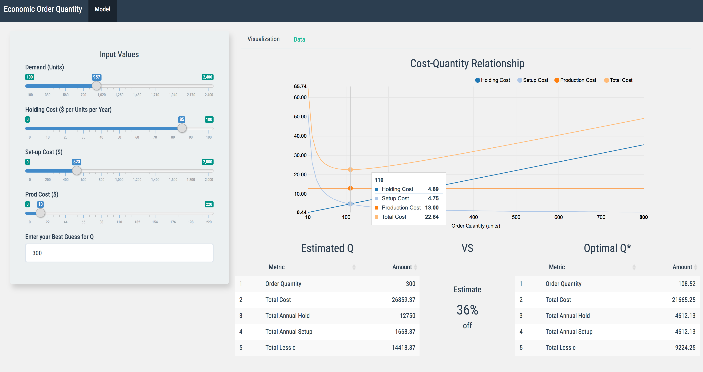

# Economic-Order-Quantity-Model
by _Mustafa Waheed_

This interactive  R Shiny App Implements a version of the _Economic Order Quantity_ model from  
the discpline of Inventory Optimization  

This application also would require you to have:  :  
*R version 3.3.3*

The data for this example is  generated in the app itself.  

